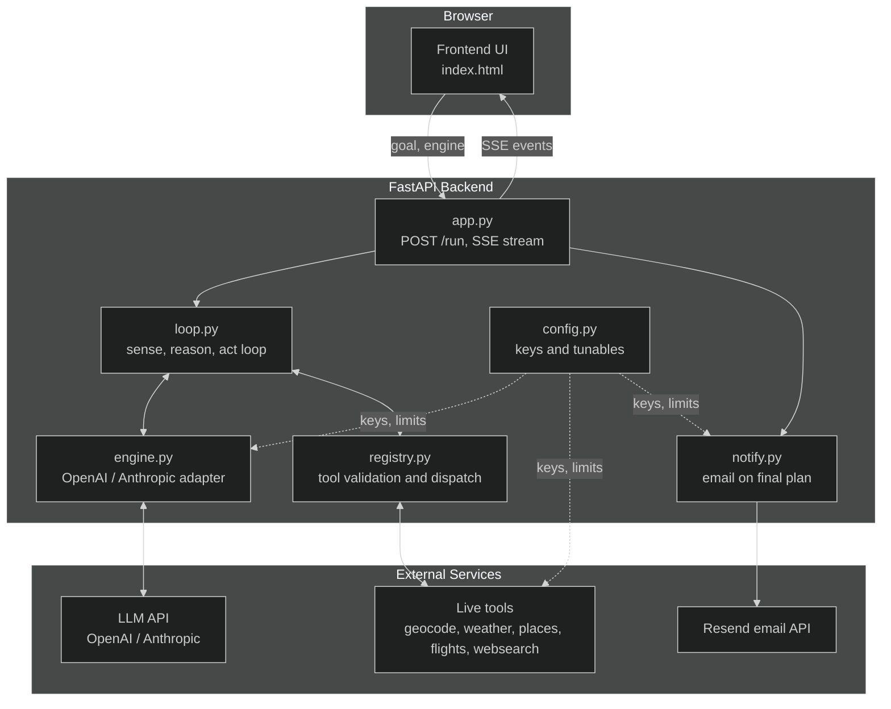
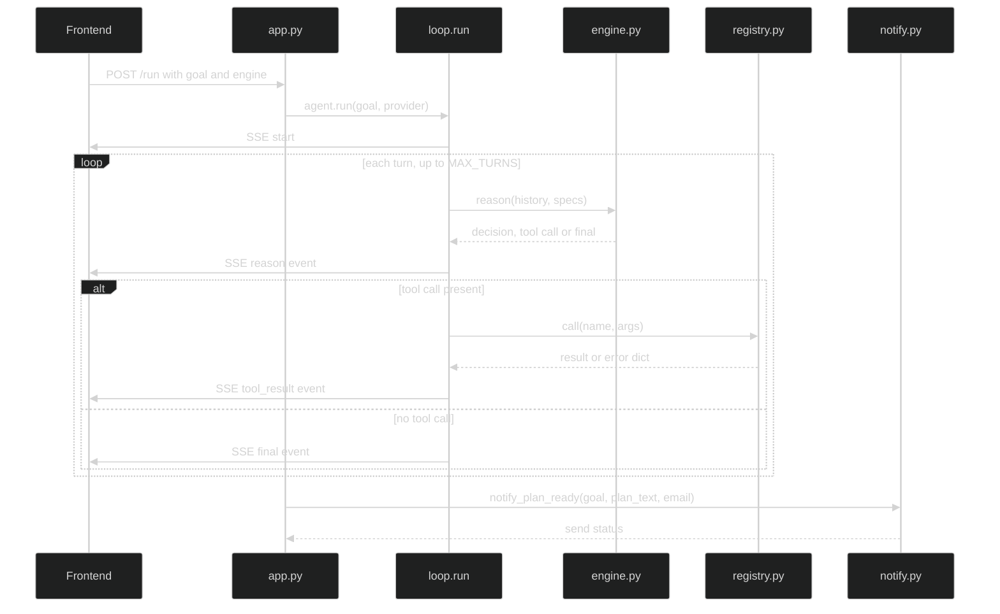
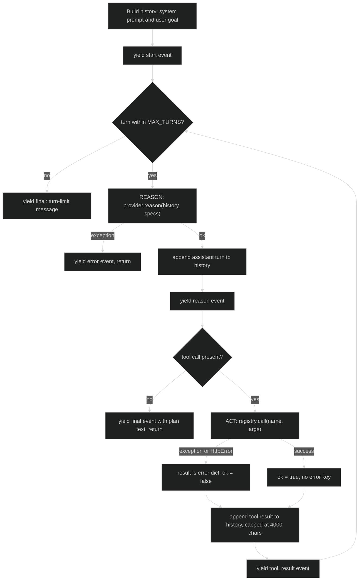

# Trip Agent · Flow

## 1. High-level architecture

Boxes group by where they run: **Browser** (just the UI), **Backend** (the loop is
the engine room, talking to the LLM adapter and the tool registry every turn),
**External** (the actual paid APIs). Dotted lines show `config.py` feeding
credentials/limits to anything that needs them.

## 2. Request flow (sequence)

## 3. Inside `loop.run()` — per-turn logic

